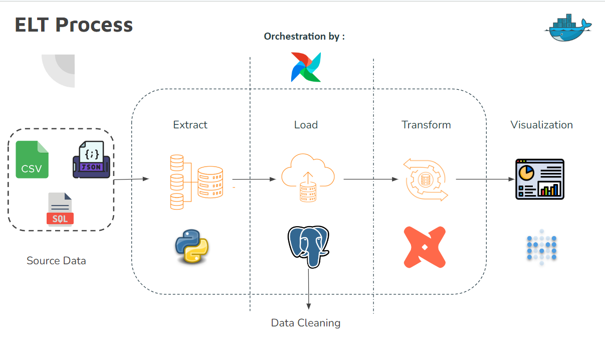
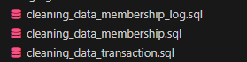
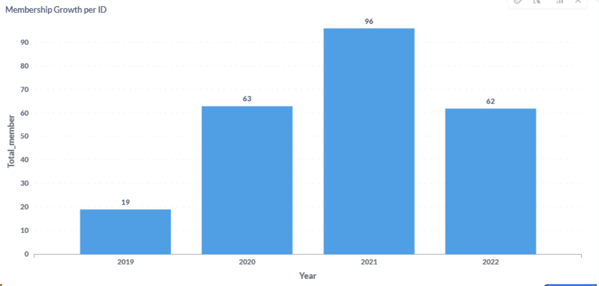
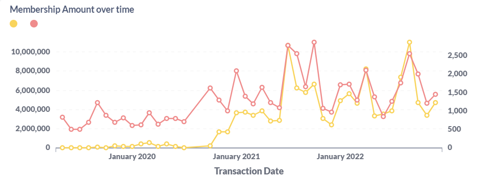
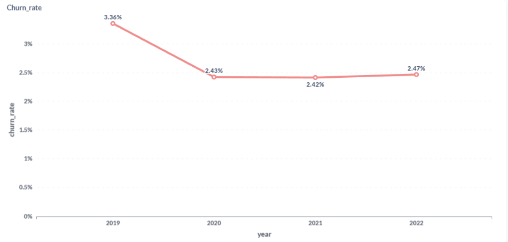
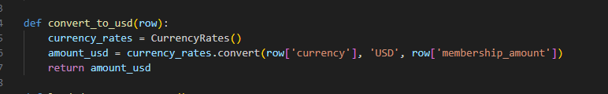
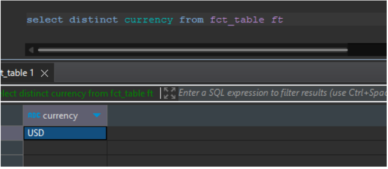
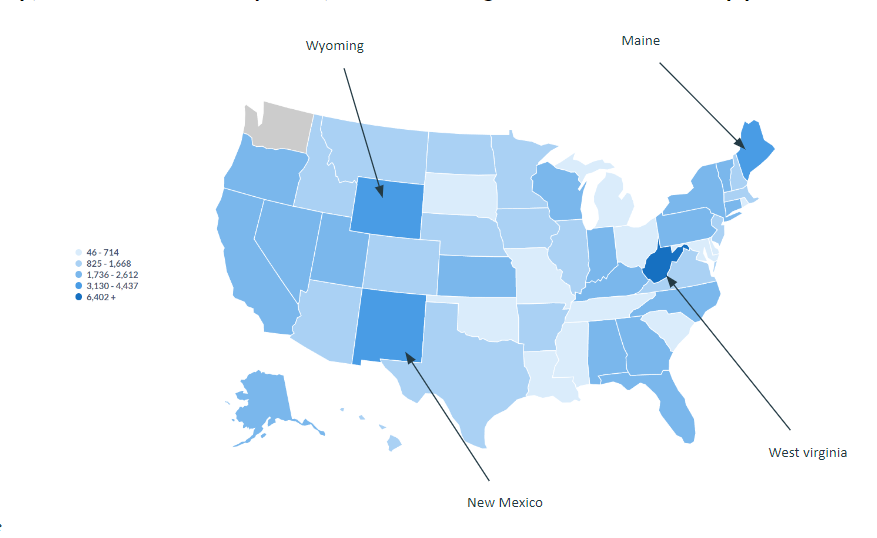
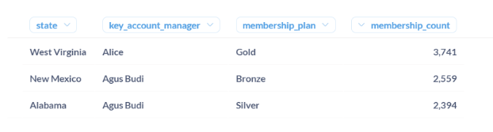

# XYZ Firm Project
This repo is a demonstration of ELT process,data analysis and visualization.

# About The Project

PT. XYZ specializes in providing video animation consultation services to its predominantly international client base. They offer membership services and maintain comprehensive data on affiliate businesses and membership statuses. This analysis specifically targets multinational clients headquartered in the United States between 2019 and 2022.

#  Objectives

1. Ensure accurate tracking of PT. XYZ's membership growth and historical data annually from 2019 to 2022. 
2. Calculate the churn rate to find out the annual number of memberships discontinuing their subscriptions to PT. XYZ.
3. Converting and consolidating all payment transactions into revenue calculations in a single currency (USD).
4. Visualize the distribution of memberships based on state, key account manager, and membership plan.

# 🖥️ Tools and Tech

</a>
</a>
</a>
</a>


# 🚀 ELT Process

**>>>If you want to use airbyte to ingest data, you can use [airbyte branch](https://github.com/CharisChakim/Membership-Optimization-and-Business-Performance-Analysis-of-XYZ-Firm/tree/airbyte)**



In the data cleaning stage, you can follow step by step in cleaning_data SQL file or copy it into PostgreSQL and run it.



# 📍 Analysis Result

1. Ensure accurate tracking of PT. XYZ's membership growth and historical data annually from 2019 to 2022.

    

    **Overall growth**: Membership has grown steadily from 19 in 2019 to 96 in 2021, representing a growth more than 5 times over the three-year period. In the last year, growth has decreased quite significantly, around 35%, so that the total number of members currently stands at 240 members 

    
    **Growth** : The chart shows a steady increase in the number of memberships approved over a two-year period, from around 500 in January 2020 to around 2,500 in January 2022. This represents a significant growth of approximately 400%. This suggests that the organization has been successful in attracting new members.
    
2. Calculate the churn rate to find out the annual number of memberships discontinuing their subscriptions to PT. XYZ.

    

    **Overall churn rate**: The overall churn rate has decreased steadily over the four years, from 3.36% in 2019 to 2.47% in 2022. This indicates that the service has been successful in retaining its subscribers over time.

    **Year-over-year changes**: The largest decrease in churn rate occurred between 2019 and 2020, with a drop of almost 1%. The churn rate remained relatively stable between 2020 and 2022.

3. Converting and consolidating all payment transactions into revenue calculations in a single currency (USD).

    We can use **from forex_python.converter import CurrencyRates** library for do this, the converting will do base on realtime currency because the currency will always change day to day.

    

    so when we check on database will no more other currencies

    

4. Visualize the distribution of memberships based on state, key account manager, and membership plan.

    

    In this map, we can see if our biggest member was on west virginia, New Mexico,Wyoming,  and Maine with total more than 6k member from any membership plan in that state.

    

    We can see based on the table, If **West Virginia** has the **most members with gold plan** with 3,741 members and **Alice** as account manager there.

    **New Mexico is the 3rd largest** member with 2,559 members with silver membership. **Agus budi** dominate in 2 state in 3 largest membership based on membership plan


# 🏃 Run Locally

**>>>Clone on airbyte branch if you want to ingesting data with airbyte [airbyte branch](https://github.com/CharisChakim/Membership-Optimization-and-Business-Performance-Analysis-of-XYZ-Firm/tree/airbyte)**

Clone the project
```
git clone https://github.com/CharisChakim/Membership-Optimization-and-Business-Performance-Analysis-of-XYZ-Firm.git
```

Run docker compose
```
docker compose up -d
```

You can access airflow at `localhost:8080`

After logging in, you can set the PostgreSQL connection in the admin tab and name it as 'pg_conn.' Configure it with settings similar to those in the existing configuration in [docker-compose.yaml](https://github.com/CharisChakim/Membership-Optimization-and-Business-Performance-Analysis-of-XYZ-Firm/blob/main/docker-compose.yaml)

You can run/trigger the Extract_Load_DAG first then dag_dbt after configure it well.

Next, you can access Metabase at localhost:3000. Configure the connection to the PostgreSQL data warehouse.
Unleash your imagination and creativity to visualize data using Metabase.

<!-- # 💻 Visualization Sampl -->

# 🧔 Author

- Charis Chakim [](https://github.com/CharisChakim)

- Muhammad Rifa [](https://github.com/Rifa8)
