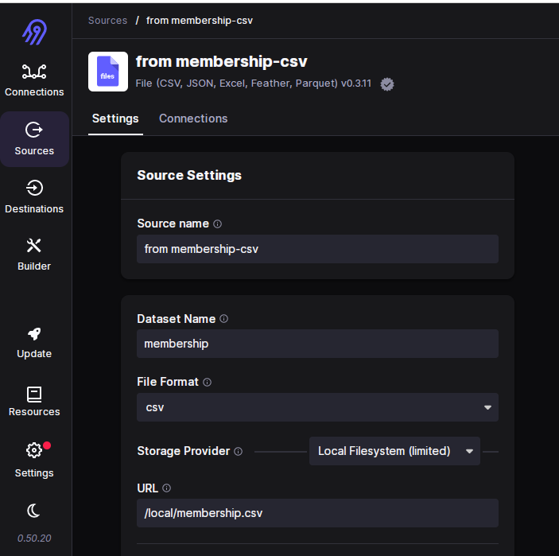
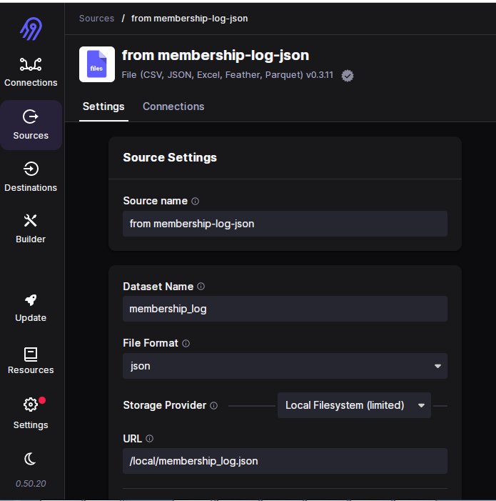
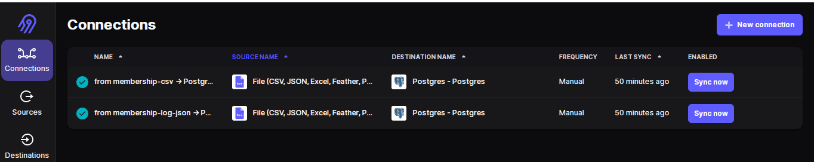
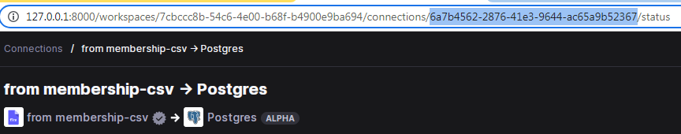
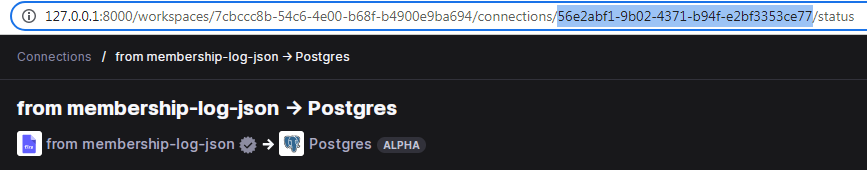
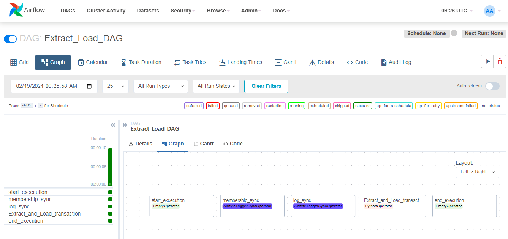
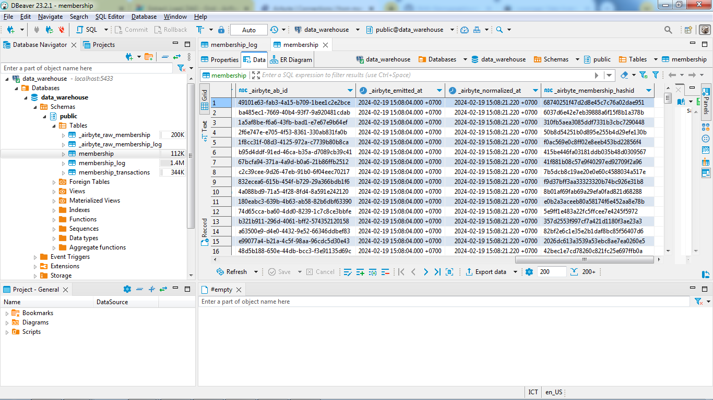

# 📌 In this airbyte branch
- Using Airbyte by creating connections to extract and load data from local files to data warehouse.
- Using Airflow to trigger Airbyte to synchronize data with Airbyte connections.

# 🏃 How to start
In [docker-compose.yaml](docker-compose.yaml) line 22, add:
```
_PIP_ADDITIONAL_REQUIREMENTS: 'apache-airflow-providers-airbyte apache-airflow-providers-airbyte[http]'
```

In [.env](airbyte/.env) file, set `LOCAL_ROOT` in line 28 and `LOCAL_DOCKER_MOUNT` in line 29 with path to `dataset/` directory in your local.

Run the `up` function in `docker.sh` file to run both the Airbyte and Airflow docker-compose.yaml
```
./docker.sh up
```
If you can't execute the docker.sh file, run the following command to add execute permission
```
chmod +x docker.sh
```
or
```
sudo chmod +x docker.sh
```

After doing that, you can access Airbyte at `localhost:8000` and Airflow at `localhost:8080`. In Airbyte, define 2 Sources, both from Files (CSV and JSON), and 1 Destination (Postgres). Then create 2 Connections from each source to Postgres.

TIPS:
- Fill the URL to the Local Filesystem with `/local/<filename>`.
- If there's a problem reading the JSON file, add the Reader Options field while defining the source with `{"encoding":"utf-8-sig"}`.





Copy and paste each connection ID from the address bar into `membership_conn_id` and `log_conn_id` in [dag_sync_airbyte.py](dags/dag_sync_airbyte.py) line 10 and 11.




In Airflow, create 2 connections, `call-airbyte` and `pg_conn`. Configure them with settings similar to those in the existing configuration files in [env](airbyte/.env) and [docker-compose.yaml](docker-compose.yaml).

After that, the rest steps are the same with the main branch. You can run/trigger the Extract_Load_DAG first.




Before running `dag_for_dbt`, perform the Data Cleaning for each table with SQL in DBeaver to handle duplicate data, missing data, incorrect data type, inconsistent data, etc. You can see how to do the query in these files: [membership](cleaning_data_membership.sql), [log](cleaning_data_membership_log.sql) and [transaction](cleaning_data_transaction.sql)

Next, you can access Metabase at localhost:3000. Configure the connection to the PostgreSQL data warehouse. Explore the data and create insightful visualizations using Metabase.

To end your session (stop and remove all containers and volumes), run the `down` function in the `docker.sh` file.
```
./docker.sh down
```
